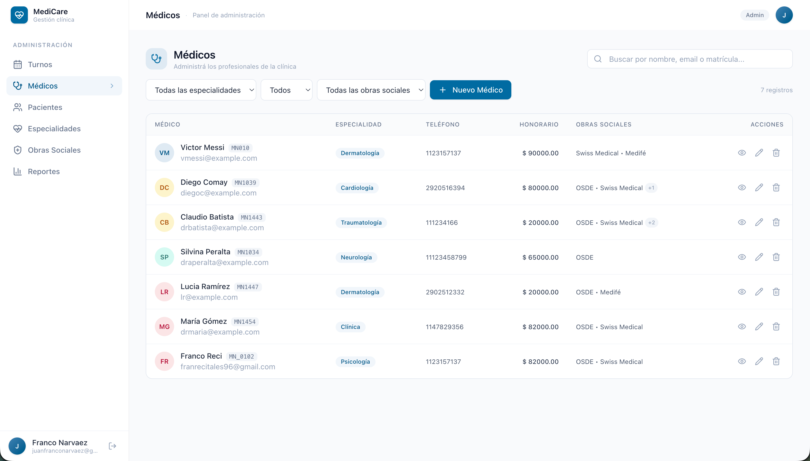
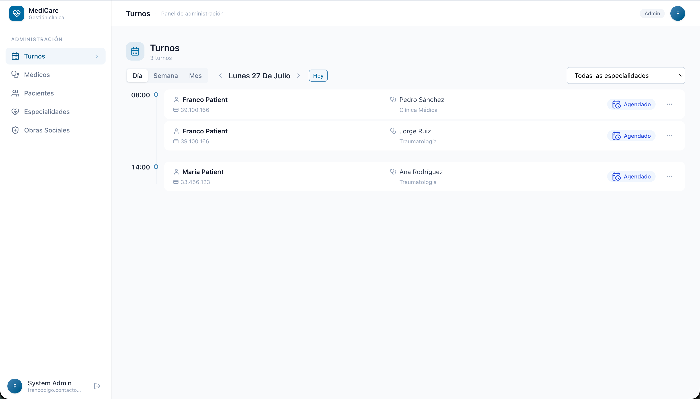

# 🧑‍⚕️ Frontend Administrativo / Profesional

> Trabajo Final  
> Tecnicatura Universitaria en Desarrollo Web  
> **Desarrollado por:** Franco Narvaez

## 📋 Descripción

Este proyecto corresponde al frontend administrativo/profesional del **Sistema de Gestión de Turnos para una Clínica**.

La aplicación está orientada a la gestión interna de la clínica, permitiendo a los usuarios autorizados administrar profesionales, especialidades, horarios de atención y turnos asignados.

El sistema consume los servicios expuestos por el backend Django mediante una API, centralizando la lógica de negocio y la persistencia de datos.

---

## ✨ Funcionalidades

- 🔐 Autenticación de usuarios administrativos y profesionales.
- 👨‍⚕️ Gestión de Doctores.
- 🏥 Gestión de especialidades médicas y obras sociales.
- 🗓️ Administración de horarios de atención.
- 📅 Visualización y gestión de turnos.
- ✅ Confirmación y actualización del estado de turnos.

## Deploy

- 🚀 [**DEPLOY.md**](https://github.com/francodevarg/trabajo_final_tudw_frontend_admin/blob/master/DEPLOY.md): guía de instalación, configuración del entorno.

## Screenshots

  

  

